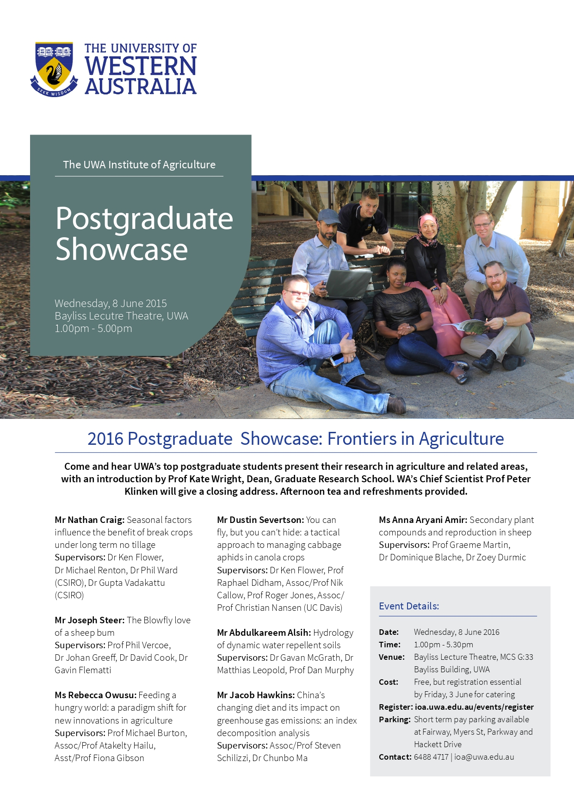

<!-- Header & Intro -->
<h1 align="center"> Dr. Abdulkareem Sahab Aldabsa (DrAldabsa)</h1>

  <strong>PhD Researcher | Soil Physics & Hydrology | Agricultural & Environmental Data Specialist</strong>

---

## 🔎 About Me
Experienced researcher with a strong focus on **agricultural and environmental sciences**, specializing in **remote sensing, soil physics, hydrology, and geospatial analysis** using **ArcGIS, R, and Python**.

I combine **field and laboratory work** with advanced algorithms and image processing methods to understand and monitor soil and land properties. I enjoy creating solutions that bridge scientific research and real-world impact.

🔹 Fluent in **Arabic** and **English**  
🔹 Collaborative, adaptable, and passionate about data-driven research

---

## 🧠 Skills & Technologies

### 🧪 Research & Field Methods
- Soil Physics & Hydraulics
- CT Scanning
- Geophysics (ERT, EMI)

### 💻 Programming & Analysis
- **Languages:** Python, R  
- **Tools:** ArcGIS, CT imaging software  
- **Libraries:** Pandas, NumPy, ggplot2, dplyr

### 📊 Data & Modeling
- Statistical analysis
- Deep Learning modeling
- Remote sensing image processing

---

## 💼 Professional Experience

### **Director**  
**Agricultural Training Extension Centre (Head Manager) — Salah al-Din, Iraq**  
*Sep 2018 – till now*  
Led extension services, training programs, and agricultural outreach to farmers and stakeholders.

### **Laboratory Assistant**  
**School of Agriculture and Environment, UWA (Australia)**  
*May 2018 – Sep 2018*  
Conducted soil physics experiments, data collection, and analysis.

### **PhD Researcher**  
**School of Agriculture and Environment, University of Western Australia**  
*Jul 2014 – Jul 2018*  
Focused on soil hydrology, imaging analysis, and integration of field and computational methods.

### **Agricultural Consultant**  
**Iraq Ministry of Agriculture — Extension Department**  
*Jul 2006 – Jul 2013*  
Applied research insights on model farms; developed extension materials and training.

### **Technician — Irrigation Systems**  
**Al-Dour Agricultural Company, Iraq**  
*Jul 2005 – Jul 2006*  
Managed and maintained center pivot and sprinkler irrigation systems.

---

## 🏆 Key Achievements & Projects

- **Trainer of Trainers (TOT)** with *Deutsche Welthungerhilfe (WHH)* — delivered courses on soil preparation, irrigation design, and sustainable resource management.  
  *Baiji, Salah Al-Din | Aug–Sep 2023 & Sep–Oct 2022*

- **Lead Developer & Admin** of the *Farm With Us* agricultural application (funded by WHH)  
  👉 https://play.google.com/store/apps/details?id=com.bazyan.farmwithus

- **Admin** for *Al Rafidain for Agriculture* application (MoA & FAO collaboration)  
  👉 https://play.google.com/store/apps/details?id=com.fao.digitalafrica

- Designed and **programmed a Wheat Crop App (in progress)** to support farmers with decision-making tools.

- Developed **practical methods** to help farmers evaluate dynamic water-repellent soils and optimize soil treatment costs.

- Implemented **new monitoring techniques** (Infrared imaging, ERT, EMI) to spatially map soil hydraulic properties.

- Introduced **innovative soil management practices** such as evaporation control through mulching and natural soil sterilization techniques in greenhouse environments.

- Organized workshops and stakeholder meetings to identify and solve agricultural yield-limiting issues.

---

## 🚀 Projects & Research Highlights

Below are some highlights from my research and development work:

- **Dynamic water repellence detection and monitoring**
- **Spatial soil hydraulic property mapping using geophysics**
- **Evaporation control techniques in greenhouse soils**
- **Customized agricultural mobile applications for extension services**

---

## 🎓 Education

**PhD, School of Agriculture and Environment**  
*The University of Western Australia* | 2013–2017  
Research focus: Soil Physics, Hydrology & Remote Sensing Analysis

**Master of Science in Soil and Water Resources Sciences (High Distinction)**  
*University of Tikrit* | 2007–2010

**Bachelor of Agriculture**  
*University of Tikrit* | 2001–2005

---

## 🏅 Awards & Honors

### 🎖 UWA Students Showcase — Postgraduate Talent Honour  
**June 2016**  
Selected as one of the top postgraduate students at **The University of Western Australia** to present research in agriculture and related areas at the *UWA Postgraduate Showcase*.  
📄 See the official event details: [2016 Postgraduate Showcase Flyer (UWA)](https://www.gga.org.au/wp-content/uploads/2016/04/PG-Showcase-Flyer-8-June-2016.pdf) :contentReference[oaicite:1]{index=1}

This award highlights academic excellence and strong communication of research findings to both academic and industry audiences.
-

---

## 📫 Let's Connect

📩 Email: agri_1982@yahoo.com  
🔗 LinkedIn: https://www.linkedin.com/feed
🔗 GitHub: https://github.com/DrAldabsa

---

